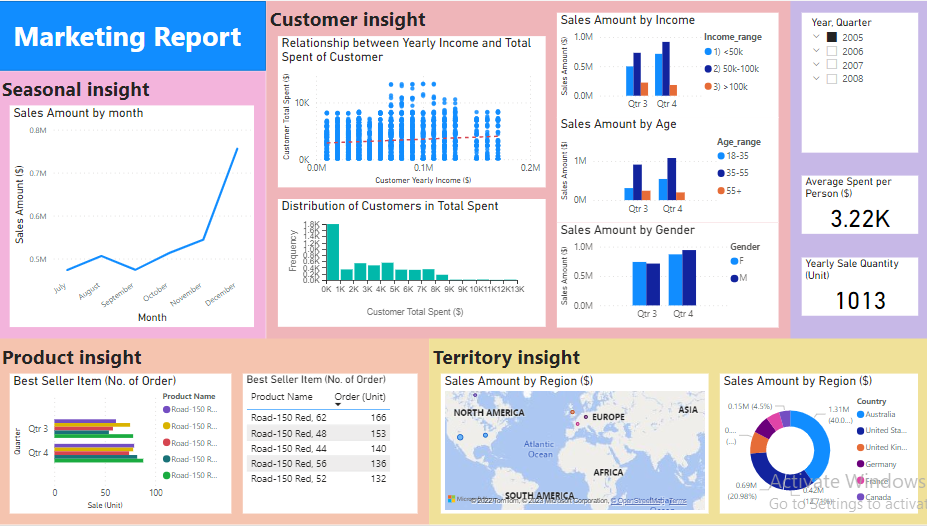

# `Internet Sales Data visulization using powerBI`

# Instructor : Huynh Trung Luong 

## Technologies Used
* Python 
* PowerBI

## Project Description :

* <strong>Significance of Visualization in the Data Pipeline:</strong> Visualization is a critical component of the data pipeline, especially as it occurs towards the final stages of data processing. After collecting, analyzing, and modeling the data, visualization plays a crucial role in conveying insights effectively to stakeholders such as managers and stakeholders. Failing to deliver clear and productive visualizations can undermine the entire process, rendering it less impactful or even wasteful.
* <strong>Dataset and Focus: </strong> The project is centered around the analysis and visualization of the "Internet Sales" dataset, which contains transactional information from an unnamed organization. This dataset is enriched with additional details like customer information, product data, and sales territories through various join tables. The project's focus is directed towards marketing analysis, with the primary target audience being the Marketing Manager. The intention is to present information regarding identifiable patterns within the data, which can be harnessed by the marketing department to optimize sales strategies or uncover latent marketing challenges.
* <strong>Enhancing Marketing Strategies:</strong> The overarching goal of this project is to extract valuable insights from the data and transform them into actionable recommendations for the marketing department. By identifying patterns within the data, the marketing team gains the ability to capitalize on these trends to enhance sales performance. 

## The final dashboard can be seen below. 

